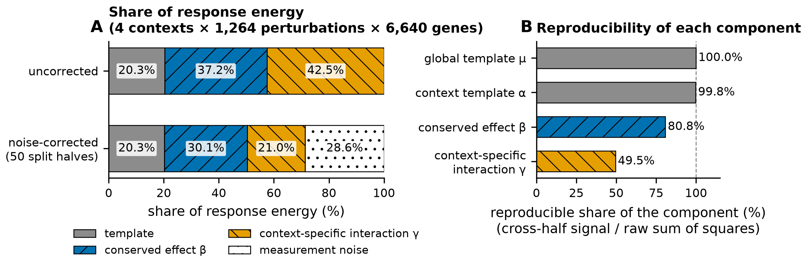
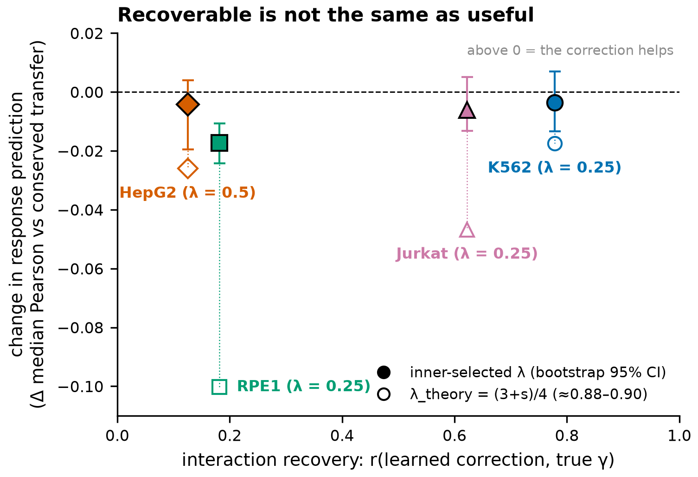
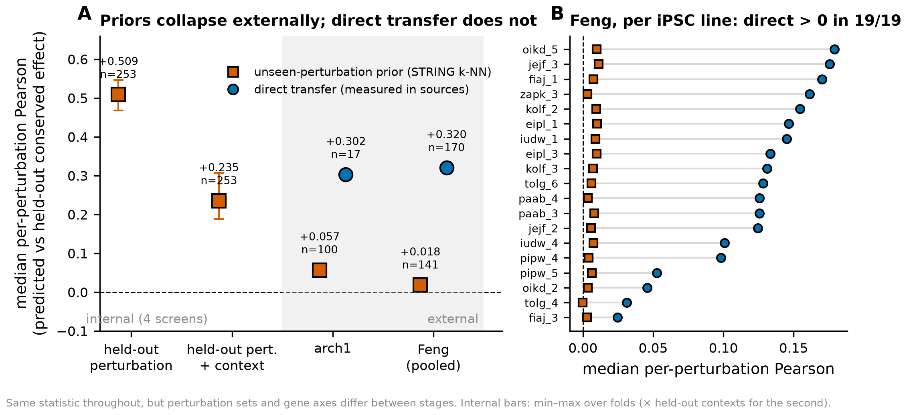
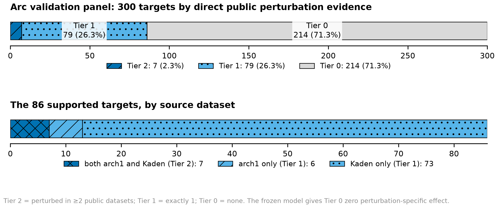
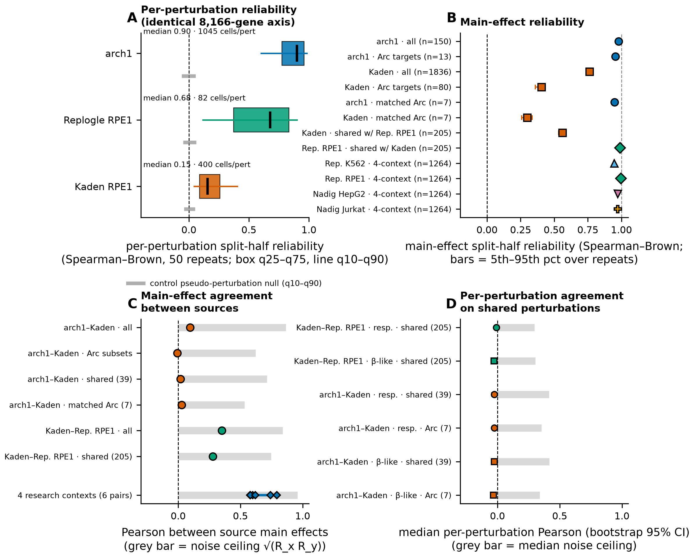

# Zero-Shot Virtual Cell Modeling Across Unseen Cellular Contexts

Research code for predicting transcriptional responses to CRISPRi genetic
perturbations in cellular contexts that were never seen perturbed.

The project serves two purposes at once:

1. an entry to the **2026 Arc Institute Virtual Cell Challenge**, and
2. an **independent research project** on zero-shot cross-context perturbation
   prediction.

The full specification, phased plan, and scientific background live in
[`plans.MD`](plans.MD). Literature notes are in
[`reports/literature_notes.md`](reports/literature_notes.md) and a running
research log in [`reports/research_log.md`](reports/research_log.md).

## Research question

Molina and Zhang (bioRxiv, July 2026) decompose a pseudobulk perturbation
response into a global term, a cell-line term, a **conserved perturbation
effect** shared across contexts, and a **context x perturbation interaction**.
On four CRISPRi cell lines the interaction holds about a quarter of the
reproducible variance, the conserved effect transfers to unseen lines, and
the interaction could not be predicted zero-shot from basal expression, gene
priors, or source-context responses by any model they tested.

This project asked three questions, in order. **All three now have answers**,
and they are the reason the model is as small as it is:

- **A.** *How much context-specific response is identifiable at all under truly
  zero-shot context shift?* — **Answered.** The interaction is real (21% of
  response energy) but about half measurement noise, and is recoverable
  zero-shot only where a genuinely similar partner context exists.
- **B.** *Can richer context-conditioned biological priors recover any
  predictable portion of the interaction?* — **Answered: no.** Pathway-level
  gamma modelling was carried to a clean beta-free target, improved gamma
  prediction sharply, improved *response* prediction in no context, and was
  **terminated** under a predeclared stopping rule.
- **C.** *Can we identify which conserved effects are transferable enough to act
  on?* — **Answered, and the winner is the simplest statistic.** Raw source
  agreement predicts transfer quality in all four held-out contexts, beating
  every fitted alternative. It has **not been tested externally**, and it is not
  used on Arc, where supported targets have only one or two sources. *(An
  earlier version of this line said it "did not replicate externally"; that was
  **neighbour agreement**, a different statistic for never-perturbed genes. See
  [`reports/repository_state_notes.md`](reports/repository_state_notes.md).)*

A fourth question arrived with the Arc panel, where 214 of 300 targets are
perturbed nowhere in public data: *can a perturbation's effect be predicted from
priors alone, with no measurement of that knockdown anywhere?* **Answered: no**,
on two independent external datasets. See
[`reports/arc_count_space_baseline_v1.md`](reports/arc_count_space_baseline_v1.md)
for what the programme was ultimately able to build, and what still blocks it.

## The Arc 2026 task in one paragraph

Arc performed CRISPRi Perturb-seq in six undisclosed cell lines from
different tissues of origin. Participants
receive only non-targeting control cells for each context (about 18,400 per
context) and a list of about 300 target genes. They must submit predicted
**raw single-cell count profiles**: exactly 400 cells per perturbation, across
all 18,533 genes, for all three contexts in the current phase, with no control
cells included. Three contexts (A/B/C) are used for validation with a live
leaderboard; three different contexts (D/E/F), released October 22, 2026, are
used for the final ranking. Final submissions are due November 5, 2026, 23:59
UTC. Scoring uses six metrics normalised so that Arc's official mean-response
baseline scores 0 and an experimental replicate anchor scores 1. A
perturbation-specific conserved-effect model is not that baseline and can score
above 0 — but the zero is the **context mean perturbation response**, not the
control, and a control-emitting submission scores **−0.311**. That number is the
one to beat, and it is why estimating the context main effect matters as much as
predicting individual perturbations. Sources are cited in
`reports/literature_notes.md`.

## Current status (as of 2026-09-25)

The research programme is **frozen** and the Arc track has produced its first
**validated dry-run bundle** — 360,000 cells accepted by `vcc prep --dry-run`,
not submitted. An exact Molina & Zhang reproduction is **blocked and closed**
(their released processed data does not exist publicly) and was replaced by an
**independent four-context re-derivation** on standardized public scPertEval
data, which passed its gate. Pathway/gamma modelling is **terminated**;
prior-derived prediction of unseen perturbations **failed externally** on two
independent datasets and is not to be reopened. The current model is the
smallest one that evidence supports: `delta_hat = m_hat + w[tier] * beta_hat`,
with `beta_hat = 0` exactly wherever no direct perturbation evidence exists.

**The single blocker for a real submission** is that `m_hat` is not estimable
from the public data that covers Arc's panel: the only two datasets perturbing
Arc targets have mean perturbation responses that are essentially uncorrelated
(cosine 0.089, and **0.030** on the seven targets both measure), so the frozen
estimator correctly shrinks toward zero and 214 of 300 targets end up close to
control-emitting. A better estimator is not the fix. Details and the ordered
list of what remains: [section L of the count-space
report](reports/arc_count_space_baseline_v1.md).

**Submission candidate v1 (2026-09-25):** the frozen dry run is packaged as
`outputs/arc_submission_v1/virtual_cell_generalization_val_v1.vcc` (SHA-256
`16a5b17c…390910`), audited and frozen, and **not submitted**. See
[`reports/arc_submission_v1_manifest.md`](reports/arc_submission_v1_manifest.md) and the
pre-result expectations in
[`reports/arc_submission_v1_expectations.md`](reports/arc_submission_v1_expectations.md).

**New (2026-09-25): that disagreement is not measurement noise.** A predeclared
split-half diagnostic ([`reports/kaden_source_reliability_diagnostic_v1.md`](reports/kaden_source_reliability_diagnostic_v1.md))
found Kaden's individual responses weak (median reliability 0.17 against
arch1's 0.91) and its main effect moderately reliable (0.76). The two sources'
main effects could have agreed up to a noise ceiling of 0.86; they agree at
0.095. Kaden also disagrees with the same-cell-line Replogle RPE1 screen. The
predeclared verdict is **CASE E, mixed / inconclusive**: the frozen model is
unchanged, and no reliability-exclusion v2 follows from it. Terminology that
had drifted between documents is pinned in
[`reports/repository_state_notes.md`](reports/repository_state_notes.md).

## Key figures

The complete suite (nine figures, each reproducible from frozen artifacts, with
provenance) is indexed in [`reports/figures/README.md`](reports/figures/README.md)
and [`reports/figures/FIGURE_MANIFEST.md`](reports/figures/FIGURE_MANIFEST.md).

**A conserved effect and a real but noisy interaction.** After noise
correction the conserved effect β holds 30% of response energy and the
interaction γ 21%, but γ is only half reproducible.



**Recovering the interaction did not make prediction better.** Pathway-level γ
is genuinely recoverable in some contexts, but no correction improved the
response prediction, and the theoretically correct weight made every context
worse. This is why pathway modelling was terminated.



**Priors collapse externally; measured perturbations keep transferring.**



**Most of the Arc panel has no direct public evidence,** and 73 of the 86
supported targets rest on Kaden alone.



**And the one source behind most of that support is weak and disagrees with
everyone.** Kaden's disagreement with arch1 sits far below the noise ceiling.



## Status in detail

Implemented:

- `virtual_cell.data.io`: robust `.h5ad` loader with integrity checks
  (non-empty, unique genes and cells, finite non-negative integer counts,
  exactly one context label per file, exact label matching).
- `virtual_cell.data.summary`: per-context statistics (cells, genes, library
  size mean/median/min/max, sparsity, genes detected per cell).
- `virtual_cell.data.arc2026`: the official Arc 2026 control bundle as a module
  — manifest/`gene_names.csv`/`pert_counts.csv` loading, memory-safe streaming
  over the CSR count matrices, a single-pass per-context audit, cross-context
  invariant checks, panel composition, and checksum helpers.
- `virtual_cell.data.synthetic`: deterministic synthetic control contexts for
  pipeline development (Poisson noise, no biology).
- `virtual_cell.preprocessing.pseudobulk`: library-size normalisation, mean
  expression profiles, shared-gene alignment, cross-context basal comparison.
- `virtual_cell.decomposition.anova`: our own four-component response
  decomposition (`delta = mu + alpha + beta + gamma`), faithful to Molina &
  Zhang's reference implementation, with projective template removal and
  split-half noise correction.
- `virtual_cell.data.scperteval`: the four-context scPertEval bundle — registry
  with audited sizes/checksums, memory-safe metadata reads, identifier-only
  intersections, and streaming pseudobulk.
- `virtual_cell.analysis.robustness`: sensitivity variants — control-split
  schemes, aggregation orders, control-derived HVG ranking, controlled-depth
  reliability.
- `virtual_cell.analysis.loco`: leave-one-context-out folds, source-only
  zero-shot baselines, and the derived/validated reliability corrections
  (`sqrt(rho)` ceiling, disattenuation, Spearman-Brown).
- `virtual_cell.analysis.foundations`: template/scale estimators, MSigDB pathway
  aggregation, candidate transferability targets, and partial correlation.
- `virtual_cell.analysis.falsification`: matched null representations
  (gene-label permutation, size-matched resampling, random projection) and
  vectorised recoverability.
- `virtual_cell.priors.catalogue` and `virtual_cell.priors.features`: external
  biological priors (STRING, DepMap, MSigDB, basal expression) as feature
  blocks, with a leakage audit on every block.
- `virtual_cell.modelling.unseen_perturbation`: the two-axis held-out design
  (perturbation, context, and both together) and the low-capacity estimators
  for perturbations measured nowhere.
- `virtual_cell.modelling.external_benchmark` and
  `virtual_cell.modelling.multicontext`: scoring a frozen predictor on external
  datasets, including the delta-matrix path used for Feng's 19 cell lines.
- `virtual_cell.modelling.context_main_effect`: the distinction between the
  **oracle** context main effect `m_c` (an evaluation target) and the
  **feasible** estimators that read only target controls and source responses.
- `virtual_cell.modelling.pathway_residual`: nested-LOCO pathway residual model
  — scale-calibrated baseline, low-capacity families, shrinkage selection.
- `virtual_cell.modelling.pathway_gamma_v2`: the v2 clean (beta-free) gamma
  target and the theory coefficient `(3+s)/4`.
- `virtual_cell.modelling.transferability`: reliability-aware confidence targets
  (`<h1,h2>`, `<h1-B,h2-B>`, `D`), the derived stability rule, selective
  prediction and experiment-prioritisation metrics.
- `virtual_cell.modelling.mean_response`: **the Arc model** —
  `delta_hat = m_hat + w[tier] * beta_hat`, the five feasible main-effect
  estimators, centred source transfer, and nested tier-shrinkage selection with
  Tier 0 pinned to exactly zero.
- `virtual_cell.data.counts`: exact recovery of raw integer counts from a
  `log1p(CP10K)` matrix, with the residual scale ambiguity stated and tested.
  This is what makes a public count-space benchmark possible at all.
- `virtual_cell.arc.panel`: maps a response onto the 18,533-gene panel with
  every gene assigned an explicit support category, so "predicted unchanged"
  and "never measured" stay distinguishable.
- `virtual_cell.arc.generate`: three count generators — control resampling,
  control transport, and a negative-binomial count model.
- `virtual_cell.arc.metrics`: a local reimplementation of the six scored
  `vcc2026` metrics, so a candidate can be measured before it is submitted.
- `virtual_cell.analysis.source_reliability`: block split-half reliability for
  datasets too large to hold in memory, main-effect reliability, noise ceilings
  and disattenuation, used by the Kaden source-reliability diagnostic.
- `virtual_cell.visualization` (`style`, `common`, `sources`): the figure layer.
  One style, deterministic extraction of small figure-source tables from frozen
  artifacts, and a provenance sidecar per table.
- `virtual_cell.arc.bundle`: pseudobulk response to multiplicative effect, the
  unsupported-gene rule, a streaming writer for a 360,000-cell submission, and a
  local pre-submission inspection.
- `scripts/download_scperteval.sh`, `scripts/scperteval_provenance.py`,
  `scripts/build_four_context_decomposition.py`,
  `scripts/run_four_context_sensitivity.py`,
  `scripts/plot_four_context_sensitivity.py`,
  `scripts/run_zero_shot_recoverability.py`,
  `scripts/plot_zero_shot_recoverability.py`,
  `scripts/run_transferability_foundations.py`,
  `scripts/plot_transferability_foundations.py`,
  `scripts/run_pathway_falsification.py`,
  `scripts/plot_pathway_falsification.py`,
  `scripts/run_pathway_residual_model.py`,
  `scripts/run_pathway_residual_model_v2.py`,
  `scripts/plot_pathway_residual_model.py`,
  `scripts/run_transferability_confidence.py`,
  `scripts/plot_transferability_confidence.py`,
  `scripts/run_unseen_perturbation.py`, `scripts/run_external_validation.py`,
  `scripts/run_arch1_external.py`, `scripts/run_feng_multicontext.py`,
  `scripts/run_arc_bridge.py`, `scripts/audit_public_datasets.py`.
- `scripts/run_arc_count_space_baseline.py`, `scripts/run_count_generator_benchmark.py`,
  `scripts/run_arc_dry_run.py`: the Arc count-space phase — main-effect and
  shrinkage selection on public folds, the count generator benchmark, and the
  A/B/C dry-run bundle.
- `scripts/run_kaden_source_reliability.py`: the predeclared Kaden
  source-reliability diagnostic (writes `predeclaration.json` before reading
  any expression value).
- `scripts/figures/`: `extract_figure_sources.py`, one `plot_*.py` per
  figure, and `build_figure_manifest.py`.
- `scripts/audit_arc2026_controls.py`: reproducible read-only audit of the
  official controls; writes tables and figures to
  `outputs/arc2026_controls_audit/`.
- `scripts/make_synthetic_controls.py`: writes synthetic contexts A/B/C.
- `scripts/explore_synthetic_contexts.py`: prints AnnData structure, summary
  table, basal-mean comparison, and saves a figure to `outputs/exploration/`.
- `tests/`: **544 tests**, all passing. Data-gated tests skip when the datasets
  they need are absent.

  | area | file | tests |
  |---|---|---|
  | official Arc control bundle | `test_arc2026_controls.py` | 29 |
  | Arc bridge: panel, generators, metrics | `test_arc_bridge.py` | 42 |
  | submission assembly and the unsupported-gene rule | `test_bundle.py` | 27 |
  | count recovery and its scale ambiguity | `test_counts.py` | 15 |
  | response decomposition mathematics | `test_decomposition.py` | 41 |
  | external-dataset scoring | `test_external_benchmark.py` | 6 |
  | matched nulls for representation falsification | `test_falsification.py` | 28 |
  | template/scale estimators, pathway aggregation | `test_foundations.py` | 34 |
  | `.h5ad` loading and integrity | `test_io.py` | 16 |
  | LOCO leakage algebra, reliability corrections | `test_loco.py` | 27 |
  | tiered mean-response model and its leakage contract | `test_mean_response.py` | 26 |
  | multi-context delta-matrix scoring path | `test_multicontext.py` | 12 |
  | v2 clean-target algebra | `test_pathway_gamma_v2.py` | 17 |
  | nested LOCO, residual algebra, outer-target isolation | `test_pathway_residual.py` | 31 |
  | normalisation and pseudobulk | `test_pseudobulk.py` | 5 |
  | preprocessing-sensitivity variants | `test_robustness.py` | 20 |
  | scPertEval bundle and streaming pseudobulk | `test_scperteval.py` | 23 |
  | per-context summary statistics | `test_summary.py` | 6 |
  | synthetic fixtures | `test_synthetic.py` | 4 |
  | reliability-aware targets, selective prediction | `test_transferability.py` | 33 |
  | two-axis held-out design and priors | `test_unseen_perturbation.py` | 49 |
  | block split-half machinery | `test_source_reliability.py` | 10 |
  | figure-source reproducibility, frozen-model and freeze invariants | `test_figures.py` | 34 |
  | Kaden diagnostic: predeclaration, leakage, intersections, axes | `test_kaden_diagnostic.py` | 9 |

### Official validation controls, audited 2026-09-18

All 44 invariants passed. Full report:
[`reports/arc2026_controls_audit.md`](reports/arc2026_controls_audit.md).

| | A | B | C |
|---|---|---|---|
| shape (cells x genes) | 18,400 x 18,533 | 18,400 x 18,533 | 18,400 x 18,533 |
| sparsity | 0.678 | 0.702 | 0.683 |
| library size median | 20,109 | 19,946 | 20,034 |
| genes detected median | 6,147 | 5,756 | 6,006 |

Control cells only (`target_gene == 'non-targeting'`), 46 shared non-targeting
guides x 400 cells per context, identical gene order across contexts matching
`gene_names.csv` exactly, raw integer counts stored as float32 CSR. Basal
pseudobulk Pearson (per-gene mean of `log1p(1e4 * count / library)`, the
convention used throughout this project): A-B 0.688, A-C 0.602, B-C 0.732 — the
three contexts are far apart at baseline and separate completely under PCA.
*(`reports/arc2026_submission_requirements.md` quotes 0.78 / 0.75 / 0.84 for the
same pairs; that is `log1p(CPM)` of the pooled profile, a different quantity.
The two are not comparable and only the second should be set against the four
public contexts' 0.89-0.93.)*

Two findings that constrain later work: the 18,533-gene panel excludes all
ribosomal protein genes and mitochondrial rRNA, so absolute expression is not
comparable to unfiltered public data; and context B has a low-depth tail
(2.5% of cells under 2,000 UMIs) that A and C do not, so any per-cell QC
threshold will hit B alone.

### Response-decomposition gate — two tracks

**Exact Molina & Zhang reproduction: BLOCKED, closed.** Audit of
[`xinyizhanglab/perturbation-decomposition`](https://github.com/xinyizhanglab/perturbation-decomposition)
@ `a152147` found that the processed pseudobulk and DepMap embeddings its README
calls "included" are excluded by its own `.gitignore`, with no releases, tags,
forks or external deposit, and that the upstream preprocessing which builds its
response space is absent from the repository entirely. Details and the full
frozen specification of their method:
[`reports/molina_zhang_reproduction_spec.md`](reports/molina_zhang_reproduction_spec.md).

**Independent four-context re-derivation: DONE, gate passed.** Standardized public data for
the same four cell lines is available from
[scPertEval](https://github.com/Virtual-Cell-Research-Community/scPertEval)
@ `4685f11` — K562, RPE1, HepG2 and Jurkat as log-normalised AnnData with fully
documented preprocessing. Audited without downloading (24.2 MB of HDF5 metadata
read over HTTP range requests): **1,264 perturbations and 6,640 genes shared
across all four**, 7.549 GB total. Specification, proposed pipeline and gate
criteria:
[`reports/scperteval_four_context_data_spec.md`](reports/scperteval_four_context_data_spec.md).

This second track is **not** a reproduction of Molina & Zhang and must never be
described as one; matching their reported 27.8 / 29.4 / 23.5 / 19.3 is
explicitly not a gate criterion.

**Canonical v1 result** ([`reports/four_context_decomposition_v1.md`](reports/four_context_decomposition_v1.md)):
on the frozen 1,264-perturbation x 6,640-gene balanced design, response energy
splits into template 20.27%, conserved beta 30.07%, interaction gamma 21.05% and
measurement noise 28.62% (50 split-half resamples, sd < 0.05 pp). The more
informative number is per-component reproducibility: mu 100%, alpha 99.8%,
**beta 80.8%, gamma 49.5%** — the interaction is real and substantial but is
about half measurement noise, and carries 75% of all noise in the decomposition.

**Robustness battery** ([`reports/four_context_decomposition_sensitivity.md`](reports/four_context_decomposition_sensitivity.md)):
across 21 variant x feature-space combinations — independent control split, three
feature spaces, both aggregation orders, five seeds — beta stays in 27.98-30.79%
and noise-corrected gamma in 20.55-22.80%, while uncorrected gamma (38.5-45.1%)
is roughly double corrected gamma everywhere. Independently splitting the control
cells changes beta and gamma by *exactly* 0.000 pp, moving 0.25 pp from template
into noise — control-estimation error is confined to the mu+alpha subspace by
construction. A controlled experiment on 643 fixed (context, perturbation) pairs
re-estimated at 15/30/50/100 cells shows median reliability rising 0.097 -> 0.419
with non-overlapping CIs and 99.5% of pairs improving.

**Gate status: all six criteria pass — the independent four-context
decomposition gate is met.** It remains an independent re-derivation, not a
Molina & Zhang reproduction.

### Zero-shot recoverability diagnostic

[`reports/zero_shot_recoverability_v1.md`](reports/zero_shot_recoverability_v1.md).
Four frozen leave-one-context-out folds with an enforced leakage contract
(tested by replacing the whole target row with noise and requiring every
baseline to be bit-identical). Conserved source-only transfer reaches median
per-perturbation Pearson **0.306**, or **0.49-0.64** of the attainable latent
correlation after reliability normalisation — but explains **negative** response
energy (-0.138), because the held-out template and scale are not recoverable
from source responses. Gamma is partially recoverable zero-shot **only where a
genuinely similar partner context exists** (K562 r=0.185, Jurkat r=0.217; RPE1
and HepG2 ~0), tracking the single cross-context pair whose gamma correlation
exceeds the forced null. **Source agreement** among the three source responses
predicts transfer success at Spearman **+0.726** after reliability
normalisation and is computable at inference time.

### Transferability foundations

[`reports/transferability_foundations_v1.md`](reports/transferability_foundations_v1.md).
Three results. **Basal control expression does not encode the context response
template** — gene-wise alignment is ~0 and sign-inconsistent, and only 0.15-8.2%
of alpha lies in the span of source basal deviations. **Scale calibration, not
template offset, fixes the negative energy explained**: a single scalar
shrinkage (0.43-0.47 on the 6,640-gene space, fitted leave-one-source-out on
sources alone; the same estimator gives 0.52-0.59 in Hallmark pathway space) lifts every
fold, while even the *oracle* template leaves three of four negative.
**Pathway-level gamma is ~3x more recoverable than gene-level** (Hallmark: K562
0.185 -> 0.570, Jurkat 0.217 -> 0.510, reaching 0.60-0.65 of the measurement
ceiling), though HepG2 stays at zero at every resolution. Source agreement
survives joint confound control at +0.14 to +0.55 per fold.

Recommended next direction, chosen on evidence: **pathway-level gamma, combined
with scale calibration and source-agreement confidence.** Template recovery from
basal expression is ruled out. *(This recommendation was followed and the gamma
half of it was then terminated — see the next two sections. The scale
calibration survived *as a principle*: the Arc model shrinks its perturbation
term, but with separately selected tier weights (0.50 / 0.25) and a separate
main-effect scalar, not this number.)*

### Representation falsification

[`reports/pathway_gamma_falsification_v1.md`](reports/pathway_gamma_falsification_v1.md).
The pathway gain is **biology, not aggregation**. Against 100 gene-label-permuted
nulls that preserve set sizes, all pairwise set overlaps and gene degrees,
Hallmark wins in K562, RPE1 and Jurkat (z = +4.5 to +6.8, p = 0.010, the
replicate floor) and Reactome reproduces it. Critically, **random 45-dimensional
aggregation reproduces gene-level performance exactly** after reliability
normalisation — so dimensionality reduction alone buys nothing, and the
correction catches it. HepG2 is a clean negative (below its own null). Jurkat's
result collapses to -0.195 without K562 while K562 retains +0.337 without
Jurkat. The dataset-ancestry confound is **refuted**: same-dataset pairs are the
weakest.

### First predictive model — negative result

[`reports/pathway_residual_model_v1.md`](reports/pathway_residual_model_v1.md).
A low-capacity, nested-LOCO pathway residual model does **not** improve zero-shot
prediction beyond scale-calibrated conserved transfer in any context (deltas
0.000 / -0.015 / -0.003 / 0.000), and an oracle shrinkage sweep caps the maximum
attainable gain at **+0.003**. The mechanism is identified: the residual target
`R = (4/3)alpha + (1-s)beta + (1+s/3)gamma` is contaminated by the deliberately
shrunk conserved effect, and while the model *does* recover gamma in K562
(r=+0.47) and Jurkat (r=+0.43), it predicts the beta component with the wrong
sign and the two cancel. Source-agreement confidence remains strongly calibrated
(Spearman +0.53 to +0.60, monotone in every context) and is the one component
that works as intended.

**v2 removed the contamination and the verdict held**
([`reports/pathway_residual_model_v2_clean_gamma.md`](reports/pathway_residual_model_v2_clean_gamma.md)).
Training on the beta-free target raised gamma prediction sharply (K562
r = 0.47 -> **0.78**, Jurkat 0.43 -> 0.62) but still improved response prediction
in **no** context, and at the mathematically correct coefficient
`lambda = (3+s)/4` every context got materially worse. The predeclared stopping
rule fired on all three conditions, so **pathway modelling is terminated and
there will be no v3**. The next primary direction is a transferability /
confidence model on scale-calibrated conserved transfer plus source agreement —
not another gamma model.

### Transferability / confidence — the simple statistic wins

[`reports/transferability_confidence_model_v1.md`](reports/transferability_confidence_model_v1.md).
Raw **source agreement** predicts transfer quality in all four held-out contexts
(Spearman vs -D: 0.554 / 0.786 / 0.656 / 0.556), with **monotone risk-coverage
and monotone calibration everywhere, including HepG2** — the first phase in
which HepG2 behaves normally. Restricting to the most-confident 10% cuts median
D by 41% (K562), 33% (Jurkat), 32% (HepG2), 18% (RPE1), moving K562 and Jurkat
from *worse than predicting zero* to better. Neither monotone calibration nor a
regularised multivariable model beat it, so per the predeclared rule the final
estimator is **raw source agreement** — one number, no fitting, nothing to leak.

A second finding: **trustworthiness and error magnitude are near-opposite
objectives.** Targeting the least-confident perturbations captures ~half of
random; ranking by expected error magnitude captures ~twice random. A practical
system needs both scores and must not use one for the other's job.

**Framing:** the defensible claim is not "we predict context-specific responses"
but *"we predict conserved responses, and can say in advance how much to trust
each one."*

Two later qualifications, both load-bearing. **Source agreement** — agreement
among *source-context responses* for a perturbation measured in all of them —
is the statistic validated here, and it is **not** the STRING-neighbour
agreement that later failed externally; the two are different quantities and
only the second was refuted. But the trust half of the framing is **not yet
operational on Arc**: Tier-2 targets have only two source contexts and Tier-1
has one, so there is little agreement left to measure. The current Arc model
carries **no confidence term**.

Our decomposition (`delta = mu + alpha + beta + gamma`, projective template
removal, split-half noise correction) is implemented and verified by 41
mathematical tests — exact reconstruction, zero-sum constraints,
balanced-design orthogonality, planted-component recovery, permutation
invariance, split-half behaviour, frozen sets, malformed-input rejection, and
verbatim equivalence with the reference algebra.

### Unseen perturbations, and two external failures

[`reports/unseen_perturbation_generalization_v1.md`](reports/unseen_perturbation_generalization_v1.md),
[`reports/external_unseen_perturbation_validation_v1.md`](reports/external_unseen_perturbation_validation_v1.md),
[`reports/feng_multicontext_external_validation_v1.md`](reports/feng_multicontext_external_validation_v1.md).
214 of Arc's 300 targets are perturbed nowhere in public data, so the question
became whether a perturbation's effect can be predicted from priors alone. It
can, internally — and it **does not replicate externally**. On arch1 and on all
**19 Feng iPSC lines** the frozen predictor scores `r ~ 0`, while direct
measured transfer on the *same* lines scores `+0.128` per line and **`+0.320`
pooled, positive in 19 of 19**. Matched on signal strength, measured transfer
rises fivefold across quartiles while prior prediction stays flat. STRING
neighbour agreement did not replicate either and is **diagnostic only**.
**Binding: do not build another unseen-perturbation predictor.**

### Arc count-space baseline — a validated dry-run bundle

[`reports/arc_count_space_baseline_v1.md`](reports/arc_count_space_baseline_v1.md).
The frozen findings assembled into `delta_hat = m_hat + w[tier] * beta_hat` and
carried all the way to raw counts. Every free parameter chosen on public
held-out contexts: main effect `M3b_basal_shrunk`, Tier-2 shrinkage **0.50**,
Tier-1 **0.25** (unanimous over four folds, nested selection matching the outer
oracle in 6 of 8 cells), Tier 0 pinned at zero.

scPertEval's `log1p(CP10K)` turns out to be **exactly invertible** back to
integer counts (round-trip error 3.3e-07), which made a public *count-space*
benchmark possible for the first time. Scored against real held-out K562 cells
with the six `vcc2026` metrics, **control transport wins**: `pds_cosine`
0.492 → **0.882**, direction reach 0.105 → **0.404**. The prior detected-gene
defect reproduces at **−22.2%** without composition smoothing. **`G2` and more
capacity lose**, so a deep generative model is not justified.

Two results temper it. On a realistically **mixed** Arc panel `pds_cosine` is
**0.535**, not 0.725, because 214 Tier-0 targets are indistinguishable from one
another. And **`m_hat` is not estimable from Arc's actual sources**: the only
two public datasets perturbing Arc targets have mean responses with cosine
0.089, **−0.002** matched on Arc targets, and **0.030** on the 7 targets both
measure — against 0.60–0.81 among the research contexts. The estimator
correctly shrinks to 0.119 and returns almost nothing.

A full bundle was generated and validated: **360,000 cells x 18,533 genes,
2.058e9 nonzeros**, all thirteen local checks passing and `vcc prep --dry-run`
accepting it (exit 0, `verified_targets: true`, `dropped: []`). **Nothing was
submitted.**

## Setup

Requires Python 3.11 and [`uv`](https://docs.astral.sh/uv/).

```bash
uv sync                                   # create .venv and install everything
uv run python scripts/audit_arc2026_controls.py    # needs data/raw/arc2026/controls/
uv run python scripts/make_synthetic_controls.py
uv run python scripts/explore_synthetic_contexts.py
uv run pytest
uv run ruff check . && uv run ruff format --check .
```

The Arc track, in order (each needs the data it names):

```bash
uv run python scripts/run_arc_count_space_baseline.py    # m_hat and shrinkage, public folds
uv run python scripts/run_count_generator_benchmark.py   # count generators vs real cells
uv run python scripts/run_arc_dry_run.py                 # 360,000-cell dry-run bundle
```

Arc credentials are not needed for anything in the repository today. When they
are, the official tooling is the `vcc-cli` package (command `vcc`) and the
`cell-eval2` scorer; API keys must never be committed.

## Repository layout

```
plans.MD                 project specification and phased plan
README.md
pyproject.toml           uv project; packages live under src/
scripts/                 reproducible entry points (data generation, exploration)
src/virtual_cell/        research package
  data/                  io, summary statistics, synthetic data, scPertEval and
                         Arc bundles, count recovery from log-normalised data
  preprocessing/         normalisation and pseudobulk
  decomposition/         delta = mu + alpha + beta + gamma, with noise correction
  analysis/              LOCO folds, robustness, foundations, matched nulls
  modelling/             the Arc model, context main effects, and the terminated
                         pathway/unseen-perturbation lines kept for the record
  arc/                   Arc 2026 bridge: panel mapping, count generators, local
                         scorer, submission assembly
  priors/                biological priors for unseen perturbations, with leakage audit
  visualization/         figure style, figure-source extraction, provenance
  models/ evaluation/    empty placeholders; no deep model exists
tests/                   pytest suite (544 tests)
reports/                 literature notes, research log, data audits
  figures/               the figure suite (PNG + SVG), index and manifest
data/raw, data/processed, data/external   git-ignored datasets
data/provenance/         source, checksums and manifests for downloaded data
data/splits/             frozen, committed experimental designs
data/figure_sources/     small figure-source tables + provenance sidecars
outputs/                 git-ignored run outputs, figures, and the dry-run bundle
dist/                    git-ignored build artefacts
```

## Research principles

- **Scientific validity over leaderboard rank.** The research track exists
  independently of Arc placement.
- **No leakage.** A held-out context contributes only its control cells; its
  perturbation responses are never seen during training or model selection.
- **Frozen evaluation.** Test contexts and the public leave-one-context-out
  benchmark are fixed before modelling and never used for tuning.
- **Baselines first.** Control-only, mean-perturbation, conserved-effect,
  nearest-context, and linear baselines must be reported before any deep model.
- **Multiple metrics.** Arc's six metrics plus research metrics (conserved and
  interaction recovery, top-DE precision/recall, direction accuracy).
- **Exact labels.** Context labels are preserved byte-for-byte; the loader
  refuses files whose labels do not match expectations.
- **Reproducibility.** Core results run from scripts with fixed seeds; notebooks
  are for exploration only; data and model artefacts stay out of git.
- **Honest reporting.** Negative results, failed hypotheses, and ideas that are
  already in the literature are recorded as such.
