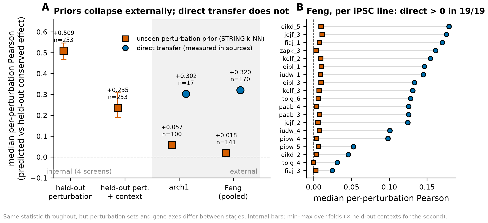
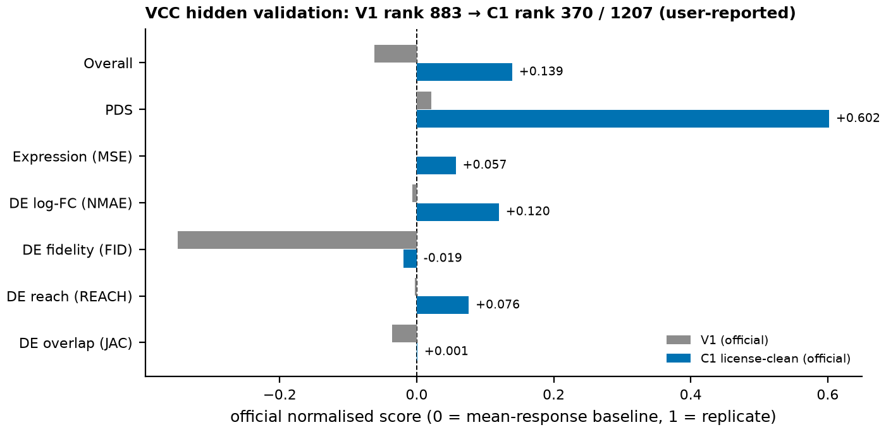
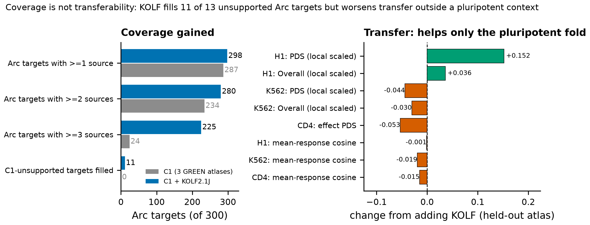

# What Transfers Across Cellular Contexts?

Research code for predicting transcriptional responses to CRISPRi perturbations in
cellular contexts where they were never measured. It is both an independent research
project on zero-shot cross-context prediction and an entry to the **Arc Institute
Virtual Cell Challenge 2026**.

**In one line:** conserved perturbation effects transfer and can be trusted, when
measured directly and when their source context transfers. Context-specific corrections,
annotation priors and raw target coverage do not buy prediction.

Project synthesis: [`reports/project_synthesis.md`](reports/project_synthesis.md) ·
paper outline: [`reports/paper_outline.md`](reports/paper_outline.md) ·
figure index: [`reports/figures/README.md`](reports/figures/README.md).

## The problem

Arc performed CRISPRi Perturb-seq in six undisclosed cell lines. Participants receive
only non-targeting control cells for each context and a list of 300 target genes. They
must predict raw single-cell counts: 400 cells per perturbation, 18,533 genes.

Scoring averages six metrics, normalised so that the context mean-response baseline
scores 0 and an experimental replicate scores 1. Three contexts (A / B / C) are used for
validation; three different ones (D / E / F) decide the final ranking.

The research question underneath is the same: given responses measured elsewhere, what
can be predicted in a context seen only through its controls?

## Findings

| # | finding | evidence |
|---|---|---|
| 1 | **A conserved effect β exists and is reproducible:** 30.1 % of response energy, 80.8 % reproducible, stable across 21 preprocessing variants | [four-context decomposition](reports/four_context_decomposition_v1.md), [sensitivity](reports/four_context_decomposition_sensitivity.md) |
| 2 | **The context interaction γ is real but not useful for prediction:** 21.0 % of energy, only 49.5 % reproducible. It is recoverable at pathway level in some contexts, but recovering it improved response prediction in no context | [pathway falsification](reports/pathway_gamma_falsification_v1.md), [clean-γ model](reports/pathway_residual_model_v2_clean_gamma.md) |
| 3 | **Priors for never-perturbed genes fail externally:** r 0.51 internally falls to 0.06 (arch1) and 0.02 (19 Feng lines); measured transfer stays at 0.30–0.32, positive in 19 / 19 lines | [external validation](reports/external_unseen_perturbation_validation_v1.md), [Feng](reports/feng_multicontext_external_validation_v1.md) |
| 4 | **Broad direct perturbation evidence moves the real score:** official Overall −0.062 → **0.139**, PDS 0.022 → 0.602, rank 883 → **370 / 1207** | [V1 result](reports/arc_submission_v1_result.md), [C1 result](reports/competition_v2/c1_official_result.md) |
| 5 | **Source agreement predicts transferability** (4 / 4 research contexts; replicated on 3 new atlases), **but shrinking or reweighting by it does not improve the predictor** | [confidence model](reports/transferability_confidence_model_v1.md), [C1](reports/competition_v2/license_clean_c1_v1.md), [C3](reports/competition_v2/c3_mean_response_fusion.md) |
| 6 | **A new source helps only if its context transfers:** KOLF iPSC improves the pluripotent fold and hurts K562 and CD4 | [C4](reports/competition_v2/c4_new_direct_evidence_audit.md) |
| 7 | **Coverage is not transferability:** KOLF fills 11 of the 13 unsupported Arc targets and still fails held-out transfer | [C4](reports/competition_v2/c4_new_direct_evidence_audit.md) |

Also established on the engineering side:

* **Generator:** the count generator is not the lever. Under the `vcc2026` metrics the
  frozen generator's DE over-calling is score-positive
  ([C2](reports/competition_v2/c2_expression_de_calibration.md)).
* **Mean response:** the fused mean's bottleneck is gene direction, not magnitude
  ([C3](reports/competition_v2/c3_mean_response_fusion.md)).

## Key figures

**A reproducible conserved effect, and a real but noisy interaction.**


**Recovering the interaction does not improve prediction.**


**Priors collapse externally; measured perturbations keep transferring.**



**Direct-atlas evidence on the hidden leaderboard (official scores, V1 → C1).**



**Coverage is not transferability.**



## Current champion

**C1a license-clean atlas**
([`reports/competition_v2/current_champion.md`](reports/competition_v2/current_champion.md)).

* **Model:** equal-weight fusion of direct CRISPRi responses from VCC 2025 H1, K562
  GWPS and CD4 DE, with a promoter-neighbour cap.
* **Coverage:** 287 / 300 targets.
* **Official validation score:** Overall 0.139, rank 370 / 1207.

The backbone reimplements AtlasShift (MIT, attributed). It is not claimed as our
contribution.

Three successor phases were predeclared and rejected:

* C2: generator and amplitude;
* C3: source reweighting;
* C4: new sources.

The only prepared change is **C5 = C1 + X-Atlas**. It is gated in code on written
permission, which is **pending** ([predeclaration](reports/competition_v2/c5_predeclaration.md),
[permission status](reports/competition_v2/xatlas_permission_status.md)).

## Reports

| area | reports |
|---|---|
| decomposition | [v1](reports/four_context_decomposition_v1.md) · [sensitivity](reports/four_context_decomposition_sensitivity.md) · [zero-shot recoverability](reports/zero_shot_recoverability_v1.md) · [foundations](reports/transferability_foundations_v1.md) |
| γ modelling (terminated) | [falsification](reports/pathway_gamma_falsification_v1.md) · [residual v1](reports/pathway_residual_model_v1.md) · [clean γ v2](reports/pathway_residual_model_v2_clean_gamma.md) |
| transferability | [confidence model](reports/transferability_confidence_model_v1.md) · [Kaden reliability](reports/kaden_source_reliability_diagnostic_v1.md) |
| unseen perturbations (closed) | [internal](reports/unseen_perturbation_generalization_v1.md) · [external](reports/external_unseen_perturbation_validation_v1.md) · [Feng 19 lines](reports/feng_multicontext_external_validation_v1.md) |
| Arc, v1 | [controls audit](reports/arc2026_controls_audit.md) · [count-space baseline](reports/arc_count_space_baseline_v1.md) · [V1 result](reports/arc_submission_v1_result.md) |
| Arc, competition v2 | [baseline expansion](reports/competition_v2/competitive_baseline_expansion_v1.md) · [license register](reports/competition_v2/data_license_register.md) · [C1](reports/competition_v2/license_clean_c1_v1.md) · [C1 official](reports/competition_v2/c1_official_result.md) · [C2](reports/competition_v2/c2_expression_de_calibration.md) · [C3](reports/competition_v2/c3_mean_response_fusion.md) · [C4](reports/competition_v2/c4_new_direct_evidence_audit.md) · [champion](reports/competition_v2/current_champion.md) · [C5 (gated)](reports/competition_v2/c5_predeclaration.md) |
| process | [research log](reports/research_log.md) · [literature notes](reports/literature_notes.md) · [terminology](reports/repository_state_notes.md) · [plan](plans.MD) |

## Reproduce

Requires Python 3.11 and [`uv`](https://docs.astral.sh/uv/). Datasets are not in git.
Each report names its inputs, scripts and freeze manifests.

```bash
uv sync
uv run pytest -q
uv run ruff check . && uv run ruff format --check .
```

Figures regenerate from frozen artifacts:

```bash
uv run python scripts/figures/extract_figure_sources.py
for f in scripts/figures/plot_*.py; do uv run python "$f"; done
uv run python scripts/figures/build_figure_manifest.py
```

Competition phases run in order from `scripts/competition_v2/`; the order is listed in
each phase report.

## Repository layout

```
src/virtual_cell/
  decomposition/      δ = μ + α + β + γ with split-half noise correction
  analysis/           LOCO folds, robustness, matched nulls, source reliability
  modelling/          research-track models, including the terminated γ and prior lines
  arc/                Arc panel, count generators, local vcc2026 metrics, submission I/O
  competition_v2/     license-clean atlas: sources, fusion, generator, evaluation,
                      C2 realisation, C3 fusion, C4 KOLF statistics, license gates
  visualization/      figure style, figure-source extraction, provenance
scripts/              reproducible entry points (research, figures/, competition_v2/)
tests/                pytest suite
reports/              reports, figures (PNG + SVG with provenance), research log
data/provenance/      checksums, freeze manifests, license evidence
data/splits/          frozen experimental designs
data/figure_sources/  small figure-source tables with provenance sidecars
```

## Principles

* **No leakage:** a held-out context contributes only its controls.
* **Predeclared rules:** every phase's pass rule is frozen by hash before results exist,
  and is never weakened afterwards.
* **Freeze manifests:** they pin every reported artifact.
* **Licensing is enforced in code:** only GREEN sources can enter a candidate.
* **Honest reporting:** negative results are reported as results, and ideas from the
  literature are attributed rather than claimed.
