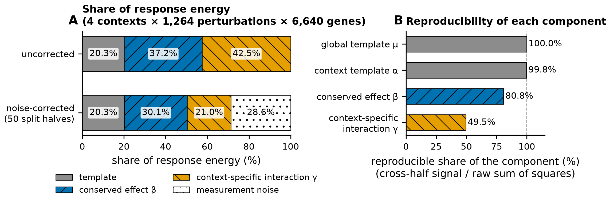
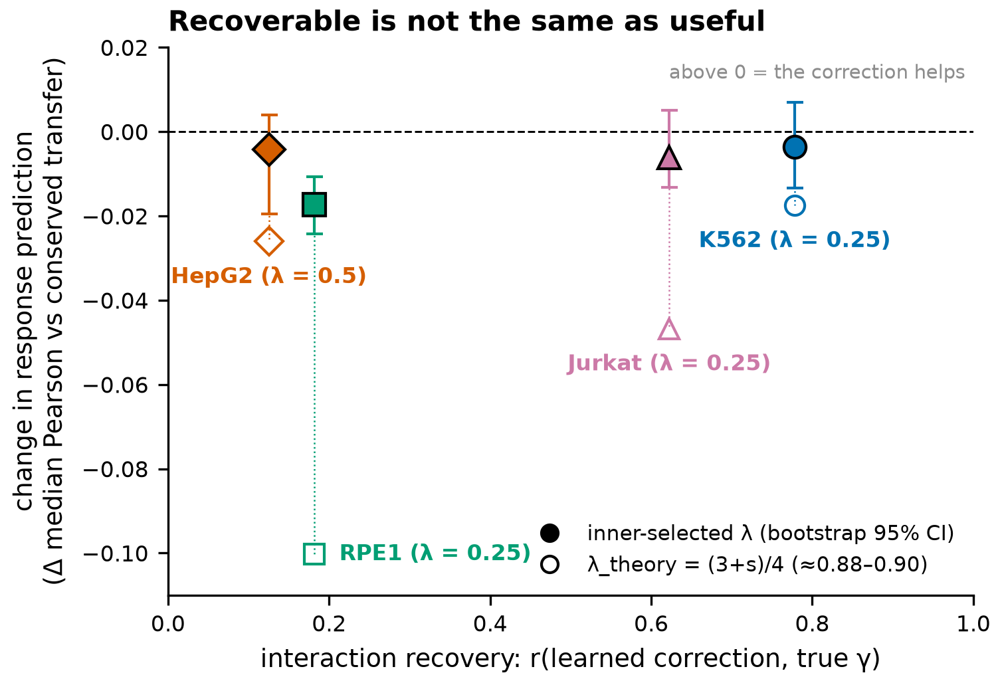

# What Transfers Across Cellular Contexts?

A preregistered study of CRISPRi Perturb-seq response transfer to cellular contexts where a perturbation was
never measured. The project asks three questions:

1. **What transfers?** Which parts of a perturbation response carry over to an unseen cell context?
2. **How much target data is needed?** How many measured perturbations in the new context does it take to
   recover what does not carry over?
3. **What makes a source useful?** Which properties of a source context determine how well its responses
   transfer?

The project began alongside an entry to the Arc Institute Virtual Cell Challenge 2026. That track is
summarised [below](#arc-virtual-cell-challenge-2026-secondary-track) and is no longer the scientific
headline.

## Status

The public-data experimental phase (N1–N6) is **complete and frozen**. Each experiment ran under a
preregistered protocol, recorded by SHA-256 before any outcome existed, and every reported artefact is pinned
by a manifest.

The project is now in:

* manuscript consolidation;
* figure development;
* final literature and novelty positioning.

No new experiment is running. The one candidate left open (a metadata-only "N7-desk" dataset audit) is
optional and not started ([N6 results §6](reports/n6_results.md)).

## Findings

### Background: replication, not a claim of novelty

* **The Molina & Zhang (2026)-style decomposition, re-derived independently.** We split each response into a
  conserved effect β and a context interaction γ, using four public CRISPRi contexts (K562, RPE1, HepG2,
  Jurkat) and split-half noise correction.
  * This is a **replication**. The decomposition is theirs
    ([novelty audit](reports/publication_novelty_audit.md)).
* **Conserved β is much more reproducible than context-specific γ.**
  * β holds 30.1 % of response energy and is 80.8 % reproducible. γ holds 21.0 % and is 49.5 % reproducible.
  * The split is stable across 21 preprocessing variants
    ([decomposition](reports/four_context_decomposition_v1.md),
    [sensitivity](reports/four_context_decomposition_sensitivity.md)).
* **Zero-shot use of γ did not help.** γ was partly recoverable zero-shot at pathway level, but only where a
  similar partner context existed. Using it as a zero-shot correction did not improve response prediction in
  any context, and that modelling line was terminated under a predeclared rule
  ([falsification](reports/pathway_gamma_falsification_v1.md),
  [clean-γ model](reports/pathway_residual_model_v2_clean_gamma.md)).
  * This concerns *zero-shot* γ only. Learning γ from target measurements is covered under N1/N3.

### N1 / N3: the calibration budget of a new context

Calibrating a held-out context means measuring k "anchor" perturbations in it and using them to correct the
source-based prediction. The primary endpoint, γ⊥, is the target response orthogonal to the source
consensus.

* **The preregistered small-budget criterion failed (FAIL-A).**
  * N1 (4 contexts): at k = 20 random anchors, γ⊥ recovery reached the required 25 % of the full-budget gain
    only in RPE1.
  * N3 (6 contexts, adding X-Atlas HCT116 and HEK293T): the failure replicated. At k = 20, recovery was 9–13 %
    of the 743-anchor value
    ([N1/N4](reports/n1_n4_results.md), [N3](reports/n3_results.md)).
* **γ is learnable, but slowly.**
  * Template and scale estimators score exactly 0 on γ⊥, and an anchor-permutation null scores ≤ 0, so any
    γ⊥ gain is genuine context × perturbation signal.
  * Recovery rises roughly log-linearly with k and has not plateaued at 743–885 anchors (35–44 % in N1;
    0.26–0.41 in N3).
* **Template and scale are learnable earlier** than genuine perturbation-specific γ.
  * In N1, about 10–20 anchors were enough, saturating by about 50. N3 widened that range to roughly 10–100.
  * A single anchor is harmful.
* **More source contexts mostly improve the zero-shot starting point.**
  * N3's Outcome-B criterion fired mechanically.
  * Exploratory decomposition showed the gain was largely an offset in the zero-shot start. Small-budget γ
    recovery, measured in each subset's own frame, is essentially flat from 3 to 5 sources.
  * The useful properties of a source were reliability and a basally similar partner, not diversity
    ([N3 §3](reports/n3_results.md)).
* **Source agreement is only a weak predictor after correction.**
  * N4 rated it WEAK: it carries some information beyond signal strength and reliability (partial
    ρ 0.12–0.22), but it does not dominate simple baselines. It is worse than plain source reliability in
    HepG2 and HCT116.

> **Correction (2026-10-07).** The previously reported source-agreement Spearman range of 0.55–0.79 was
> inflated by the evaluation-half averaging procedure: halves were averaged over repeats before energies were
> formed. The corrected repeat-wise range is **0.29–0.59**
> ([N1/N4 results §3.4](reports/n1_n4_results.md)). Frozen historical reports are unchanged.

### N5: within-study source compatibility (K562)

* **Very strong within-study compatibility.** K562 GWPS transfers to the held-out K562-essential screen with
  a noise-corrected latent cosine of **0.822 [0.808, 0.837]**. RPE1 reaches **0.379 [0.358, 0.398]**
  (difference +0.444).
* **It survives every control.** The advantage holds under reliability adjustment with perturbation fixed
  effects (which also adjust for magnitude), reliability-matched pairs, depth matching and subsampling.
  71–86 % of perturbations favour GWPS ([N5](reports/n5_results.md)).
* **This does not show that cell identity causes transfer.** GWPS and the target come from the same study and
  lab, so cell identity cannot be separated from same-study compatibility.
  * Among non-K562 sources, RPE1 shares the target's study and library yet transfers worst.
  * The result is also largely expected from prior work (Replogle 2022; Nadig 2025). N5 quantifies it
    rigorously rather than discovering it.

### N6: independent-lab K562 validation (VIPerturb-seq), inconclusive

* **Outcome D: the reliability gate failed.** VIPerturb-seq K562 (Satija lab) is a K562 screen independent
  of the target's lab. Its pooled split-half reliability was **0.0866**, below the preregistered gate of
  **0.10** ([N6](reports/n6_results.md)).
* **The positive control passed.** K562 GWPS subsampled to VIPerturb's cell counts gave a stable C_S (0.811
  vs 0.818). Low cell count alone does not explain the failed gate.
* **The N6 compatibility values are not interpretable.** All of them are reported in full, but under the
  frozen protocol none can be read biologically.
* **The same-cell / different-study question remains unresolved.** A literature search found no other public
  independent K562 Perturb-seq dataset with adequate panel overlap and expected reliability.

## Interpretation

Stated conservatively:

* **Context-specific response information has substantial sample complexity.** It is learnable from target
  measurements, but recovery rises slowly and continues into hundreds of target perturbations.
* **More source contexts do not remove the need for target-context measurements.** They mainly improve the
  zero-shot starting point.
* **Source compatibility can matter strongly.** A same-line screen from the same study transfers far better
  than any other line, beyond what reliability and depth explain.
* **What drives that compatibility is unresolved.** The relative contributions of biological cell identity
  and study/lab/platform cannot be separated with the public data examined here.

## Key reports

| report | content |
|---|---|
| [publication_novelty_audit.md](reports/publication_novelty_audit.md) | Novelty positioning and literature comparison; the plan that led to N1–N5 |
| [n1_n4_results.md](reports/n1_n4_results.md) | N1 calibration budget (FAIL-A); N4 agreement null (WEAK); agreement correction |
| [n3_results.md](reports/n3_results.md) | Six-context replication, source-count ablation, rank structure |
| [n5_protocol.md](reports/n5_protocol.md) · [n5_results.md](reports/n5_results.md) | Within-study K562 source compatibility (Outcome A) |
| [n6_protocol.md](reports/n6_protocol.md) · [n6_results.md](reports/n6_results.md) | Independent-lab K562 validation (Outcome D) |
| [viperturb_conversion_audit.md](reports/viperturb_conversion_audit.md) | VIPerturb-seq Seurat → h5ad conversion and integrity checks |
| [xatlas_license_memo.md](reports/xatlas_license_memo.md) | X-Atlas/Orion research-use scope and provenance |
| [research_log.md](reports/research_log.md) | Dated log of every phase, decision and correction |

**Earlier work:**

* [project synthesis](reports/project_synthesis.md) (as of 2026-09-30, with a dated correction)
* [paper outline](reports/paper_outline.md)
* [figure index](reports/figures/README.md)
* decomposition and zero-shot recoverability:
  [v1](reports/four_context_decomposition_v1.md) ·
  [zero-shot recoverability](reports/zero_shot_recoverability_v1.md) ·
  [foundations](reports/transferability_foundations_v1.md)
* unseen-perturbation priors: [internal](reports/unseen_perturbation_generalization_v1.md) ·
  [external](reports/external_unseen_perturbation_validation_v1.md) ·
  [Feng 19 lines](reports/feng_multicontext_external_validation_v1.md)
* process: [literature notes](reports/literature_notes.md) ·
  [terminology](reports/repository_state_notes.md)

## Figures

**β is reproducible; γ is real but noisier.**



**Zero-shot pathway-level γ recovery did not improve response prediction.** Learning γ from target anchors
(N1/N3) is a separate question.



Figures for N1–N6 are being developed.

## Data and licensing

**No raw or processed dataset is redistributed in this repository.** Data live under git-ignored `data/raw/`.
Only identifiers, checksums, frozen splits and small aggregate figure-source tables are committed.

* **Research contexts.**
  * K562, RPE1, HepG2 and Jurkat come from scPertEval-processed Replogle et al. 2022 and Nadig et al. 2025
    data ([data spec](reports/scperteval_four_context_data_spec.md)).
  * K562 GWPS comes from Replogle et al. 2022 raw counts (figshare+ 10.25452/figshare.plus.20029387,
    CC BY 4.0).
  * External prior checks used arch1 and the Feng multi-line data.
* **X-Atlas/Orion** (Xaira Therapeutics; Huang et al. 2025).
  * License: CC BY-NC-SA 4.0. Used **for non-commercial research only** (N3; HCT116/HEK293T), via the SLAF
    re-release pinned at `598aa544`, with all files re-verified against the published etags.
  * Only aggregate statistics are reported.
  * It is **not** used in any competition candidate
    ([license memo](reports/xatlas_license_memo.md)).
* **VIPerturb-seq K562** (Bradu … Satija, bioRxiv 2026; Zenodo 10.5281/zenodo.18460279).
  * License: CC BY 4.0.
  * The Seurat objects were downloaded with MD5s matching Zenodo, then converted losslessly to h5ad in an
    isolated R/SeuratObject environment. The converted file is pinned by SHA-256
    ([conversion audit](reports/viperturb_conversion_audit.md)).
* **Competition sources.**
  * VCC 2025 H1 (CC0), K562 GWPS (CC BY 4.0), CD4 GWCD4i DE statistics (MIT platform listing, with caveat),
    and KOLF2.1J iPSC (GREEN; C4 only).
  * Licensing is enforced in code: only GREEN sources can enter a candidate
    ([license register](reports/competition_v2/data_license_register.md)).

## Reproducibility

* **Frozen preregistrations.** Every N-phase protocol was hashed before data or outcomes existed and
  re-verified afterwards (`data/provenance/research_v3/*_protocol_digest.txt`). Pipelines refuse to run if
  any hashed file changed.
* **Frozen splits.** Perturbation, gene and cell-part axes live in `data/splits/`, built only from
  identifiers and QC counts.
* **Output manifests.** SHA-256 manifests pin every output (`outputs/*/manifest_sha256.txt`). Freeze files
  pin completed phases (for example `n5_freeze_sha256.txt`).
* **Leakage controls and tests.**
  * A held-out context contributes only its controls (zero-shot) or explicitly declared anchors.
  * Fit cells, evaluation cells and control parts are disjoint and asserted in code.
  * Source-only gate quantities are written before the target is read.
* **Reliability gates.** Preregistered build and outcome gates, such as the on-target knockdown check and the
  N6 Outcome-D reliability gate, decide whether a result can be interpreted at all.
* **Decisions are mechanical.** Pass rules are frozen and never weakened. Departures from a mechanical
  verdict are stated explicitly next to it.

Requires Python 3.11 and [`uv`](https://docs.astral.sh/uv/).

```bash
uv sync
uv run pytest -q
uv run ruff check . && uv run ruff format --check .
```

Each N-phase has a single frozen entry point, for example:

```bash
bash scripts/research_v3/run_n5_pipeline.sh
bash scripts/research_v3/run_n6_pipeline.sh
```

Figures regenerate from frozen artefacts:

```bash
uv run python scripts/figures/extract_figure_sources.py
for f in scripts/figures/plot_*.py; do uv run python "$f"; done
uv run python scripts/figures/build_figure_manifest.py
```

## Arc Virtual Cell Challenge 2026 (secondary track)

**The task.** Predict raw single-cell counts for 300 CRISPRi targets in six undisclosed cell lines, given only
control cells. Scoring averages six metrics, normalised against a mean-response baseline.

**Champion: C1a**, a license-clean direct-atlas fusion
([current champion](reports/competition_v2/current_champion.md)).

* **What it is.** Equal-weight fusion of direct CRISPRi responses from VCC 2025 H1, K562 GWPS and CD4 DE,
  with a promoter-neighbour cap. It covers 287/300 targets.
* **Official validation score:** Overall 0.139, rank 370/1207 (V1 was −0.062).
* **Attribution.** The backbone reimplements AtlasShift (MIT). It is not claimed as our contribution.

**Successors.** C1b, C2 (generator/amplitude), C3 (source reweighting), C4 (new sources: KOLF helped only
the pluripotent fold) and C6 (uncertainty-aware fusion) each failed a predeclared rule.

**C5 (C1 + X-Atlas)** is predeclared and gated in code. Competition use of X-Atlas still requires written
permission, which is recorded as **PENDING** ([status](reports/competition_v2/xatlas_permission_status.md)).
The research-use memo does not change this.

A panel-agnostic final-round pipeline is ready
([runbook](reports/competition_v2/final_round_runbook.md)).

Reports: [V1 result](reports/arc_submission_v1_result.md) · [C1](reports/competition_v2/license_clean_c1_v1.md)
· [C1 official](reports/competition_v2/c1_official_result.md) ·
[C2](reports/competition_v2/c2_expression_de_calibration.md) ·
[C3](reports/competition_v2/c3_mean_response_fusion.md) ·
[C4](reports/competition_v2/c4_new_direct_evidence_audit.md) ·
[C5 (gated)](reports/competition_v2/c5_predeclaration.md) ·
[C6](reports/competition_v2/c6_uncertainty_aware_transfer.md).

## Repository layout

```
src/virtual_cell/
  decomposition/      δ = μ + α + β + γ with split-half noise correction
  analysis/           LOCO folds, calibration budget, agreement null, source compatibility, reliability
  modelling/          research-track models, including the terminated γ and prior lines
  arc/                Arc panel, count generators, local vcc2026 metrics, submission I/O
  competition_v2/     license-clean atlas, fusion, generator, evaluation, C2–C6, license gates
  visualization/      figure style, figure-source extraction, provenance
scripts/              entry points (N1/N4 at top level, research_v3/ for N3–N6, figures/, competition_v2/)
tests/                pytest suite
reports/              reports, figures, research log
data/provenance/      protocol digests, freeze manifests, checksums, license evidence
data/splits/          frozen experimental designs
data/figure_sources/  small figure-source tables with provenance sidecars
```
